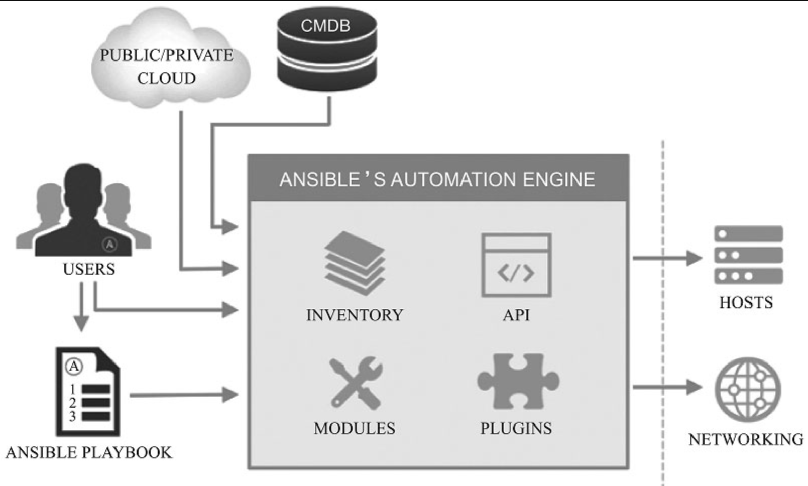
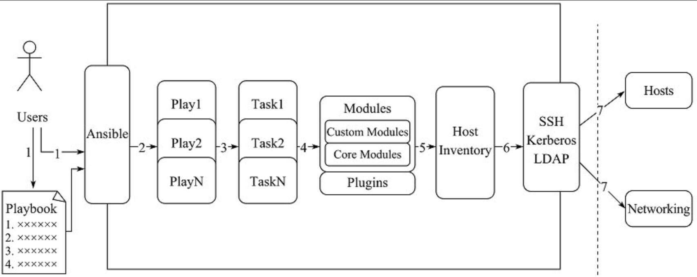

# 1. Ansible介绍

## 1.1.  什么是Ansible？

Ansible是近年越来越火的一款运维自动化工具，其主要功能是帮忙运维实现IT工作的自动化、降低人为操作失误、提高业务自动化率、提升运维工作效率，常用于软件部署自动化、配置自动化、管理自动化、系统化系统任务、持续集成、零宕机平滑升级等。它丰富的内置模块（如acl、command、shell、cron、yum、copy、file、user等，多达569个）[插图]和开放的API接口[插图]，同时任何遵循GPL[插图]协议的企业或个人都可以随意修改和发布自己的版本。

Ansible在其官网上定义如下：Ansible is a radically simple IT automation engine。即Ansible是一款极其简单的IT自动化工具。这里特别使用了radically simple来形容Ansible的简单程度，在0.X版本的Ansible官网中，更“过分”地使用Stupid Simple来形容Ansible是“令人发指的简单”。在Ansible官网的通篇文档中也不时使用Incredibly Simples、Keep It Simple、Power+Simplicity等字眼，可见Ansible这款自动化工具的设计非常注重Simple的理念。但Ansible的功能却非常不简单，完全没有因为使用方式上的简单而缩水，其自身内置模块的数量达500多个，而且还在快速地增加新模块，以下是这些模块的覆盖面的大致分类。

- 系统层：支持的系统有Linux、Windows、AIX等，对应的模块有acl、cron、pip、easy_install、yum、authorized_key等大量的内置模块；
- 知名第三方平台支持：支持的云平台有AWS、Azure、Cloudflare、Openstack、Google、Linode、Digital Ocean等，对应的模块有ec2、azure_rm_deployment、cloudflare_dns、clc_aa_policy、glance_image、gc_storage、digital_ocean等；
- 虚拟化：VMware、Docker、Cloudstack、LXC、Openstack等，对应的模块有vmware_vmkernel、docker、cs_account、lxc_container、glance_image等；
- 商业化硬件：F5、ASA、Citrix、Eos等，对应的模块有bigip_facts、asa_acl、netscaler、eos_command等；
- 系统应用层：Apache、Zabbix、Rabbitmq、SVN、GIT等，对应的模块有apache2_module、zabbix_group、rabbitmq_binding、subversion、git等。

## 1.2.  Ansible工作机制

### 1.2.1. Ansible主要组成部分

- ANSIBLE PLAYBOOKS：任务剧本（任务集），编排定义Ansible任务集的配置文件，由Ansible顺序依次执行，通常是JSON格式的YML文件；
- INVENTORY:Ansible管理主机的清单；
- MODULES:Ansible执行命令的功能模块，多数为内置的核心模块，也可自定义；
- PLUGINS：模块功能的补充，如连接类型插件、循环插件、变量插件、过滤插件等，该功能不常用。
- API：供第三方程序调用的应用程序编程接口；
- ANSIBLE：该部分图中表示的不明显，组合INVENTORY、API、MODULES、PLUGINS的绿框大家可以理解为是Ansible命令工具，其为核心执行工具；

### 1.2.2. Ansible执行任务，这些组件相互调用关系如图：

使用者使用Ansible或Ansible-playbook（会额外读取Playbook文件）时，在服务器终端输入Ansible的Ad-Hoc命令集或Playbook后，Ansible会遵循预先编排的规则将Playbooks逐条拆解为Play，再将Play组织成Ansible可识别的任务（Task），随后调用任务涉及的所有模块（Module）和插件（Plugin），根据Inventory中定义的主机列表通过SSH（Linux默认）将任务集以临时文件或命令的形式传输到远程客户端执行并返回执行结果，如果是临时文件则执行完毕后自动删除。

