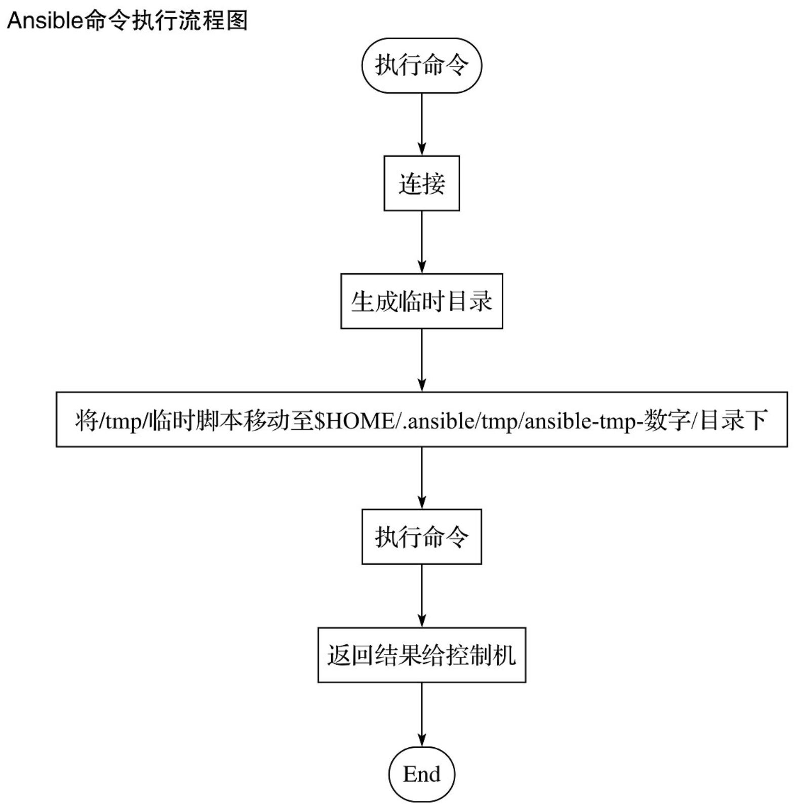
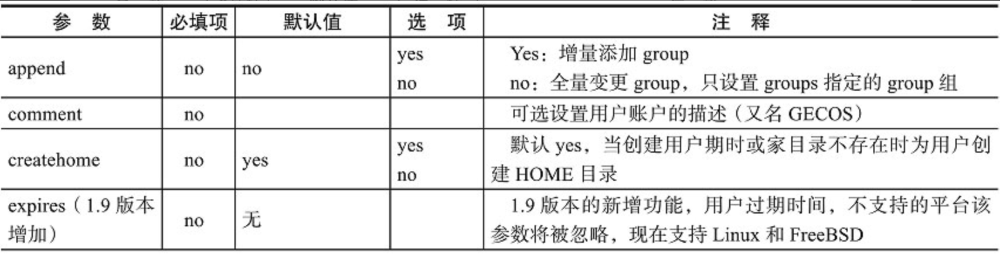
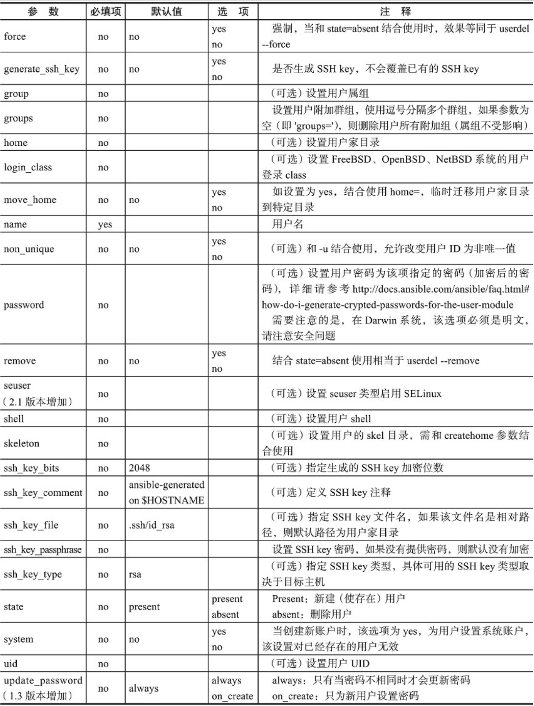

# 03 Ansible Ad-Hoc命令集

## 3.1. Ad-Hoc使用场景

- 所谓Ad-Hoc，简而言之是“临时命令”，英文中作为形容词有“特别的，临时”的含义。
- 从功能上讲，Ad-Hoc是相对Ansible-playbook而言的，Ansible提供两种完成任务方式：一种是Ad-Hoc命令集，即命令ansible，另外一种就是Ansible-playbook了，即命令ansible-playbook。
- 具体来讲，什么样的场景下我们需要用到Ad-Hoc，什么样的情况下需要使用Ansible-playbook呢？
  - （1）需要使用Ad-Hoc的场景
    - 情景1：节假日将至，我们需要关闭所有不必要的服务器，并对所有服务器进行节前健康检查。
    - 情景2：临时更新Apache &Nginx的配置文件，且需同时将其分发至所有需更新该配置的Web服务器。
  - （2）需要使用Ansible-playbook的场景
    - 情景1：新购置的服务器安装完系统后需做一系列固化的初始化工作，诸如：定制防火墙策略、添加NTP时间同步配置、添加EPEL源等。
    - 情景2：业务侧每周定期对生产环境发布更新程序代码。

## 3.2. Ad-Hoc命令集介绍

### 3.2.1. Ad-Hoc命令集用法简介

- Ad-Hoc命令集由/usr/bin/ansible实现，其命令用法如下：

  ```shell
  ansible <host-pattern> [options]
  ```

  - 可用选项如下。
    - -v, --verbose：输出更详细的执行过程信息，-vvv可得到执行过程所有信息。
    - -i PATH, --inventory=PATH：指定inventory信息，默认/etc/ansible/hosts。
    - -f NUM, --forks=NUM：并发线程数，默认5个线程。
    - --private-key=PRIVATE_KEY_FILE：指定密钥文件。
    - -m NAME, --module-name=NAME：指定执行使用的模块。
    - -M DIRECTORY, --module-path=DIRECTORY：指定模块存放路径，默认/usr/share/ansible，也可以通过ANSIBLE_LIBRARY设定默认路径。
    - -a 'ARGUMENTS', --args='ARGUMENTS'：模块参数。
    - -k, --ask-pass SSH：认证密码。
    - -K, --ask-sudo-pass sudo：用户的密码（--sudo时使用）。
    - -o, --one-line：标准输出至一行。
    - -s, --sudo：相当于Linux系统下的sudo命令。
    - -t DIRECTORY, --tree=DIRECTORY：输出信息至DIRECTORY目录下，结果文件以远程主机名命名。
    - -T SECONDS, --timeout=SECONDS：指定连接远程主机的最大超时，单位是秒。
    - -B NUM, --background=NUM：后台执行命令，超NUM秒后中止正在执行的任务。
    - -P NUM, --poll=NUM：定期返回后台任务进度。
    - -u USERNAME, --user=USERNAME：指定远程主机以USERNAME运行命令。
    - -U SUDO_USERNAME, --sudo-user=SUDO_USERNAME：使用sudo，相当于Linux下的sudo命令。
    - -c CONNECTION, --connection=CONNECTION：指定连接方式，可用选项paramiko (SSH)、ssh、local, local方式常用于crontab和kickstarts。
    - -l SUBSET, --limit=SUBSET：指定运行主机。
    - -l ～REGEX, --limit=～REGEX：指定运行主机（正则）。
    - --list-hosts：列出符合条件的主机列表，不执行任何命令。

- Ansible命令执行流程：

  

### 3.2.2. 通过Ad-Hoc查看系统设置

- 情景1：批量查看apps组所有主机的磁盘容量（使用command模块）。

  ```shell
  ansible apps -a "df -lh"
  ```

- 情景2：批量查看apps组远程主机内存使用情况（shell模块）。

  ```shell
  ansible apps -m shell -a "free -m"
  ```

### 3.2.3. 通过Ad-Hoc研究Ansible的并发特性

### 3.2.4. 通过Ad-Hoc研究Ansible的模块使用

- Ansible-doc的命令用法：

  ```shell
  ansible-doc [options] [module...]
  ```

  - 可选参数：
    - --version：显示工具版本号。
    - -h, --help：显示该help说明。
    - -M MODULE_PATH, --module-path=MODULE_PATH：指定Ansible模块的默认加载目录。
    - -l, --list：列出所有可用模块。
    - -s, --snippet：只显示playbook说明的代码段。
    - -v：等同于—version，显示工具版本号。

## 3.3. Ad-Hoc组管理和特定主机变更

### 3.3.1. Ad-Hoc组定义

- Ad-Hoc的组功能定义在Inventory文件中，默认路径是/etc/ansible/hosts，书写格式遵循INI风格，中括号中的字符为组名。可以将同一个主机同时归并到多个不同的组中；此外，若目标主机使用了非默认的SSH端口，还可以在主机名称之后使用冒号加端口号来标明。

  ```ini
  ntp.magedu.com
  [webservers]
  www1.magedu.com:2222
  www2.magedu.com
  [dbservers]
  db1.magedu.com
  db2.magedu.com
  db3.magedu.com
  ```

- 如果远程主机名称遵循相似的命名模式，还可以使用列表的方式标识各主机。

  ```ini
  [webservers]
  www[01:50].magedu.com
  [databases]
  db-[a:f].magedu.com
  ```

### 3.3.2.  Ad-Hoc配置管理：配置Proxy与Web Servers实践

### 3.3.3.  Ad-Hoc配置管理：配置NoSQL与Database Servers实践

### 3.3.4. Ad-Hoc特定主机变更

## 3.4. Ad-Hoc用户与组管理

- user模块属性

  

  

  

